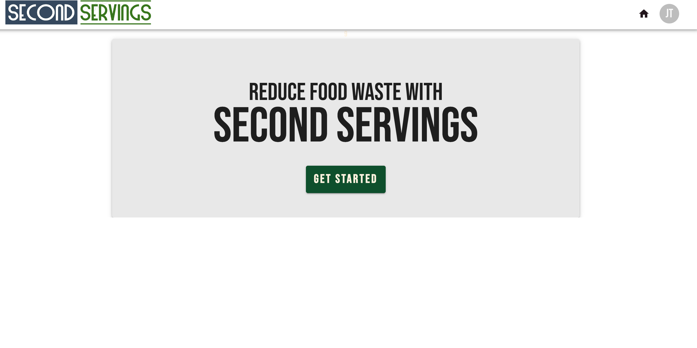
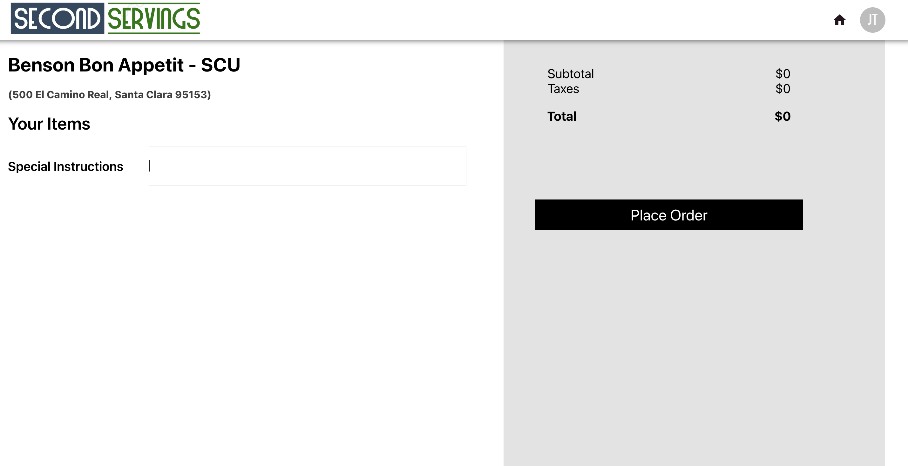

## Introduction
Second Servings is a web app built to reduce food waste.

### :camera: Screenshots

### :space_invader: Tech Stack

  
Client

  <ul>
    <li><a href="https://react.dev/">React.js</a></li>
    <li><a href="https://nextjs.org/">Next.js</a></li>
    <li><a href="https://tailwindcss.com/">TailwindCSS</a></li>
  </ul>

Database

  <ul>
    <li><a href="https://www.mongodb.com/">MongoDB</a></li>
  </ul>

 

# 🏃‍♀️ Running

-   Clone repo Run `git clone https://github.com/AbhishekShukla1289/Second-Servings.git`
-   Run `npm install`
-   Run `npm start` in backend
-   Run `npm start` in frontend
-   See `http://localhost:3000`